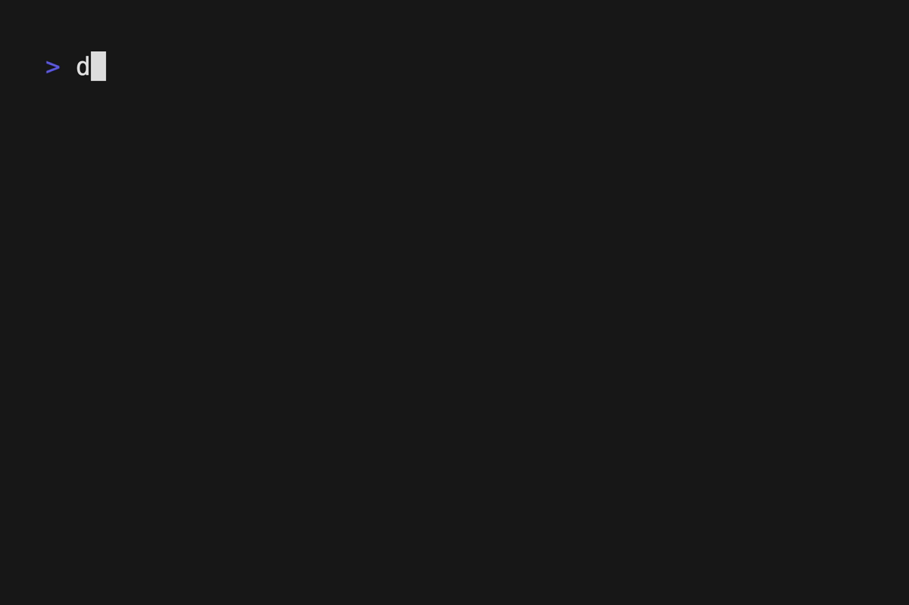

[](https://codecov.io/gh/truvami/decoder)

# 🎉 truvami Decoder 🚀

**truvami Decoder** is a command-line interface (CLI) tool written in Go for decoding truvami payloads. This reference implementation supports various payload types, including Nomad XS and different Tag formats. 🛠️

## 🎬 Demo

Check out this demo to see truvami Decoder in action! 👇



## 🌟 Features

- 🔍 **Payload Decoding**: Decode Nomad XS, Tag S/L, and Tag XL payloads with ease.
- 🌐 **HTTP Server**: Start a local HTTP server to decode payloads using RESTful APIs.
- 📄 **Flexible Output**: Choose between standard console output and JSON format.
- 🛠️ **Debugging & Verbosity**: Enable debugging and verbose output for detailed insights.
- 🖋️ **Autocompletion**: Generate autocompletion scripts for your favorite shell.
- 🚀 **Cross-Platform**: Works on Windows, macOS, and Linux.

## 📦 Installation

### 🔧 Binaries

You can install the truvami Decoder binary easily using the following command:

```zsh
# This will install the binary at $(go env GOPATH)/bin/decoder
curl -sSfL https://raw.githubusercontent.com/truvami/decoder/main/install.sh | sh -s -- -b $(go env GOPATH)/bin

# ✅ Verify the installation by checking the help
decoder --help
```

### 🖥️ Windows

For Windows users, you can install the truvami Decoder binary using Chocolatey:

```powershell
# Install using Chocolatey
choco install truvami-decoder

# ✅ Verify the installation by checking the help
decoder --help
```

### 🐳 Docker

You can also run the truvami Decoder using Docker:

```sh
# Pull the latest Docker image
docker pull ghcr.io/truvami/decoder

# Run the Docker container
docker run -it ghcr.io/truvami/decoder decoder --help

# Run the Docker container to start the HTTP server
docker run -p 8080:8080 ghcr.io/truvami/decoder decoder http --port 8080 --host 0.0.0.0
```

## 🛠️ Usage

truvami Decoder provides a variety of commands and options to help you decode payloads efficiently. Below is an overview of the available commands and flags.

### 🗂️ Basic Command Structure

```sh
decoder [command] [flags]
```

### 📝 Available Commands

- `completion` - 🖋️ Generate the autocompletion script for the specified shell.
- `help` - ℹ️ Display help information about any command.
- `nomadxs` - 🧩 Decode Nomad XS payloads.
- `tagsl` - 🏷️ Decode Tag S / L payloads.
- `tagxl` - 🏷️ Decode Tag XL payloads.
- `http` - 🌐 Start local HTTP server to decode payloads.

### 🚩 Global Flags

- `-d, --debug` - 🐛 Display debugging output in the console. (default: false)
- `-h, --help` - ℹ️ Display help information.
- `-j, --json` - 📄 Output the result in JSON format. (default: false)
- `-v, --verbose` - 📢 Display more verbose output in the console. (default: false)

### 💡 Example Usage

```sh
# 🔍 Decode a Nomad XS payload with verbose output
decoder nomadxs 1 0002c420ff005ed85a12b4180719142607240001ffbaffc2fc6f09a71d2e

# 📝 Decode a Tag S / L payload and output the result in JSON format
decoder tagsl 1 8002cdcd1300744f5e166018040b14341a -j

# 🌐 Start a HTTP server
decoder http --port 8080 --host 0.0.0.0

# 📄 Call HTTP server using curl for decoding
curl -XPOST -H "Content-type: application/json" -d '{
    "port": 1,
    "payload": "8002cdcd1300744f5e166018040b14341a",
    "devEui": ""
}' 'http://localhost:8080/tagsl/v1'

# 📄 Call HTTP server using curl for encoding (Port 128)
curl -XPOST -H "Content-type: application/json" -d '{
    "port": 128,
    "payload": {
        "ble": 1,
        "gps": 1,
        "wifi": 1,
        "localizationIntervalWhileMoving": 3600,
        "localizationIntervalWhileSteady": 7200,
        "heartbeatInterval": 86400,
        "gpsTimeoutWhileWaitingForFix": 120,
        "accelerometerWakeupThreshold": 300,
        "accelerometerDelay": 1500,
        "batteryKeepAliveMessageInterval": 21600,
        "batchSize": 10,
        "bufferSize": 4096
    },
    "devEui": ""
}' 'http://localhost:8080/encode/tagsl/v1'

# 📄 Call HTTP server using curl for encoding (Port 129)
curl -XPOST -H "Content-type: application/json" -d '{
    "port": 129,
    "payload": {
        "timeToBuzz": 16
    },
    "devEui": ""
}' 'http://localhost:8080/encode/tagsl/v1'

# 📄 Call HTTP server using curl for encoding (Port 131)
curl -XPOST -H "Content-type: application/json" -d '{
    "port": 131,
    "payload": {
        "accuracyEnhancement": 16
    },
    "devEui": ""
}' 'http://localhost:8080/encode/tagsl/v1'

# 📄 Call HTTP server using curl for encoding (Port 134)
curl -XPOST -H "Content-type: application/json" -d '{
    "port": 134,
    "payload": {
        "scanInterval": 300,
        "scanTime": 60,
        "maxBeacons": 8,
        "minRssi": -24,
        "advertisingName": "deadbeef",
        "accelerometerTriggerHoldTimer": 2000,
        "acceleratorThreshold": 1000,
        "scanMode": 0,
        "bleConfigUplinkInterval": 21600
    },
    "devEui": ""
}' 'http://localhost:8080/encode/tagsl/v1'

# 🖋️ Generate autocompletion script for bash
decoder completion bash
```

For more detailed information on each command, use:

```sh
decoder [command] --help
```

## API Endpoints

### Decode Payload

```
POST /{device_type}/v1
```

**Request Body:**

```json
{
  "port": 1,
  "payload": "hex_encoded_payload",
  "devEui": ""
}
```

**Response:**

```json
{
  "data": {
    // Decoded payload fields
  },
  "metadata": {
    // Metadata about the decoded payload
  },
  "warnings": [
    // Any warnings that occurred during decoding
  ],
  "traceId": "unique_trace_id"
}
```

### Encode Payload

```
POST /encode/{device_type}/v1
```

**Request Body:**

```json
{
  "port": 128,
  "payload": {
    // Object with fields to encode based on device type and port
  },
  "devEui": ""
}
```

**Response:**

```json
{
  "encoded": "hex_encoded_payload",
  "metadata": {
    // Any additional metadata
  },
  "warnings": [
    // Any warnings that occurred during encoding
  ],
  "traceId": "unique_trace_id"
}
```

Available device types for encoding:

- `tagsl` - Tag S/L devices
- More device types will be added as they become available
